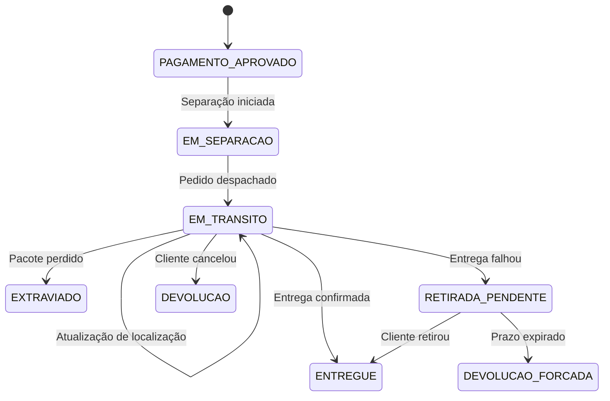
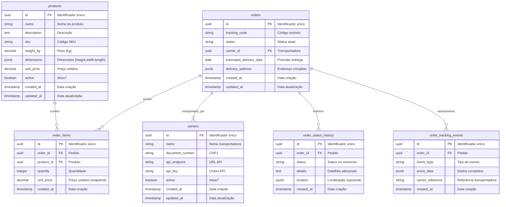

# **📦 Delivery Tracking API**  

Um microsserviço de **rastreamento de entregas (last-mile delivery)** com:  
- **API REST** para gestão de pedidos.  
- **WebSockets** para atualizações em tempo real.  
- **Mensageria com RabbitMQ** (event-driven).  
- **PostgreSQL** (banco relacional) + **Redis** (cache).  
- **Observabilidade**: Logs estruturados (Winston) + Prometheus/Grafana.  
- **Pronto para Docker** (compose com múltiplos serviços).  

---

## **🚀 Como Executar**  

### **Pré-requisitos**  
- Docker e Docker Compose instalados.  
- Node.js 18+.  

### **Passos**  
1. **Clone o repositório**:  
   ```bash  
   git clone https://github.com/athaydaooo/delivery-tracking.git  
   cd delivery-tracking  
   ```  

2. **Configure as variáveis de ambiente**:  
   - Crie um arquivo `.env` na raiz (baseado em `.env.example`).  

3. **Suba os containers**:  
   ```bash  
   docker-compose up -d  
   ```  

4. **Acesse os serviços**:  
   - **API NestJS**: `http://localhost:3000`  
   - **RabbitMQ UI**: `http://localhost:15672` (usuário: `root`, senha: `toor`)  


## **🧪 Testes**  
```bash  
# Testes unitários  
pnpm run test  

# Testes E2E  
pnpm run test:e2e  
```  

---


## **🛠️ Tecnologias**  
- **Backend**: NestJS, TypeORM, RabbitMQ.  
- **Banco de Dados**: PostgreSQL, Redis.  
- **Observabilidade**: Winston, Prometheus, Grafana.  
- **Infraestrutura**: Docker, Docker Compose.  

---

## **🛠️ Endpoints da API**  

| Endpoint | Método | Descrição | Body (Exemplo) |
|----------|--------|-----------|----------------|
| `/delivery/orders` | POST | Cria novo pedido | `{ items[], delivery_address, carrier_id }` |
| `/delivery/orders/:id/separate` | PATCH | Inicia separação | `{}` |
| `/delivery/orders/:id/ship` | PATCH | Marca como despachado | `{ tracking_code, estimated_delivery }` |
| `/delivery/orders/:id/tracking` | POST | Atualiza localização | `{ location, updated_at }` |
| `/delivery/orders/:id/deliver` | PATCH | Confirma entrega | `{ delivered_at }` |
| `/delivery/orders/:id/lost` | PATCH | Reporta extravio | `{ last_known_location }` |

---

## **🌐 Visão Geral do Sistema**  
Sistema de rastreamento de pedidos em tempo real, com:  
✅ **Atualizações de status** (separação, trânsito, entrega)  
✅ **Integração com transportadoras** (via eventos assíncronos)  
✅ **Notificações automáticas** (e-mail, push)  
✅ **Resiliência a falhas** (Dead Letter Queue)  

---

## **🔄 Fluxo do Ciclo de Vida do Pedido**  


---

## **🗃️ Diagrama do Banco de Dados**  


---

## **🐇 Arquitetura do RabbitMQ**   

### **📌 Exchange Principal**  
| Nome | Tipo | Descrição |  
|------|------|-----------|  
| `orders.topic` | `topic` | **Exchange central** que roteia todos os eventos de pedidos |  

---

### **📨 Filas e Routing Keys**  

#### **1. Criação e Separação**  
| Fila | Routing Key | Descrição |  
|------|------------|-----------|  
| `order.created.queue` | `order.created` | Pedido criado (após pagamento aprovado) |  
| `order.separation_started.queue` | `order.separation_started` | Início do processo de separação |  

#### **2. Logística e Transporte**  
| Fila | Routing Key | Descrição |  
|------|------------|-----------|  
| `order.shipped.queue` | `order.shipped` | Pedido despachado para entrega |  
| `order.location_updated.queue` | `order.location_updated` | Atualização de localização (transportadora) |  

#### **3. Entrega e Retirada**  
| Fila | Routing Key | Descrição |  
|------|------------|-----------|  
| `order.delivered.queue` | `order.delivered` | Entrega concluída com sucesso |  
| `order.pickup_pending.queue` | `order.pickup_pending` | Aguardando retirada pelo cliente |  
| `order.pickup_completed.queue` | `order.pickup_completed` | Retirada confirmada |  

#### **4. Exceções e Problemas**  
| Fila | Routing Key | Descrição |  
|------|------------|-----------|  
| `order.lost.queue` | `order.lost` | Pacote extraviado |  
| `order.returned.queue` | `order.returned` | Devolução solicitada |  
| `order.force_returned.queue` | `order.force_returned` | Devolução automática (prazo expirado) |  

#### **5. Dead Letter Queue (DLQ)**  
| Fila | Descrição |  
|------|-----------|  
| `orders.dlq` | **Fila de mensagens falhas** (recebe mensagens não processadas após 3 tentativas) |  

---

### **🔗 Bindings (Ligações)**  
Todas as filas estão vinculadas à exchange `orders.topic` com suas respectivas routing keys:  
```json
{
  "bindings": [
    {"source": "orders.topic", "destination": "order.created.queue", "routing_key": "order.created"},
    {"source": "orders.topic", "destination": "order.separation_started.queue", "routing_key": "order.separation_started"},
    {"source": "orders.topic", "destination": "order.shipped.queue", "routing_key": "order.shipped"},
    {"source": "orders.topic", "destination": "order.location_updated.queue", "routing_key": "order.location_updated"},
    {"source": "orders.topic", "destination": "order.delivered.queue", "routing_key": "order.delivered"},
    {"source": "orders.topic", "destination": "order.pickup_pending.queue", "routing_key": "order.pickup_pending"},
    {"source": "orders.topic", "destination": "order.pickup_completed.queue", "routing_key": "order.pickup_completed"},
    {"source": "orders.topic", "destination": "order.lost.queue", "routing_key": "order.lost"},
    {"source": "orders.topic", "destination": "order.returned.queue", "routing_key": "order.returned"},
    {"source": "orders.topic", "destination": "order.force_returned.queue", "routing_key": "order.force_returned"},
    {"source": "dlx.orders", "destination": "orders.dlq", "routing_key": ""}
  ]
}
```

---

### **⚙️ Configurações Técnicas**  
### **Parâmetros das Filas**  
- **Durabilidade**: Todas as filas são `durable` (sobrevivem a reinicializações).  
- **DLQ**: Todas redirecionam mensagens falhas para `orders.dlq`.  
  ```json
  {
    "arguments": {
      "x-dead-letter-exchange": "dlx.orders"
    }
  }
  ```

### **Exemplo de Publicação**  
```typescript
// Publicar evento de "pedido despachado"
channel.publish(
  'orders.topic',
  'order.shipped',
  Buffer.from(JSON.stringify({
    order_id: '123e4567-e89b-12d3-a456-426614174000',
    tracking_code: 'BR123456789',
    carrier_id: '987e6543-e21b-12d3-a456-426614174000'
  }))
);
```

---

### **🎯 Fluxo de Mensagens**  
1. **Endpoint HTTP** recebe ação (ex: pedido despachado).  
2. **Publica mensagem** na exchange `orders.topic` com routing key específica.  
3. **Fila correspondente** recebe a mensagem.  
4. **Consumidor processa** (ex: atualiza banco de dados + notifica cliente).  
5. Se falhar → Mensagem vai para `orders.dlq`.  

--- 


### **✉️ Fluxo de Mensagens**  
1. **Publicação:**  
   ```typescript
   channel.publish(
     "orders.topic", 
     "order.shipped", 
     Buffer.from(JSON.stringify(payload))
   );
   ```
2. **Consumo:**  
   ```typescript
   channel.consume("order.shipped.queue", (msg) => { ... });
   ```

---

### **⚙️ Lógicas Assíncronas (Filas)**  
| Evento (Routing Key) | Ação no Consumidor |
|----------------------|---------------------|
| `order.created` | Envia notificação de "Pedido criado" |
| `order.shipped` | Atualiza transportadora + notifica cliente |
| `order.delivered` | Dispara pesquisa de satisfação |
| `order.lost` | Aciona processo de indenização |

---

### **🚨 Tratamento de Erros (DLQ)**  
- **Quando vai para a DLQ?**  
  - Após 3 tentativas de processamento (`NACK`).  
  - Mensagens expiradas (`TTL`).  
- **Como resolver?**  
  ```bash
  # Verificar mensagens na DLQ:
  rabbitmqadmin get queue=orders.dlq
  ```

---

## **📊 Monitoramento e Alertas**  
- **Métricas:**  
  - `orders_processing_time` (Prometheus)  
  - `dlq_messages_count` (Grafana)  
- **Alertas:**  
  - Slack quando `dlq_messages_count > 0`.  

--- 

### **📌 Próximos Passos**  
- [ ] Adicionar logs estruturados (ELK).  
- [ ] Implementar retentativas exponenciais.  

**🔗 Links Úteis:**  
- [Swagger da API](#) *(em construção)*  
- [Dashboard de Monitoramento](#) *(em construção)*  

--- 

**✅ Esta documentação está atualizada com os últimos fluxos!**  
Alguma parte precisa ser ajustada ou complementada?

## **✅ Qualidade de Código**

Este projeto utiliza **Husky** e **Commitlint** para garantir a qualidade dos commits:

- **Husky**: Automatiza hooks do Git, como validação de mensagens de commit antes de finalizar (`pre-commit`, `commit-msg` etc).
- **Commitlint**: Valida se as mensagens de commit seguem o padrão convencional (Conventional Commits).

Ao tentar realizar um commit, a mensagem será checada automaticamente. Caso não esteja no padrão, o commit será rejeitado.

**Exemplo de mensagem válida:**
```
feat(order): adiciona endpoint para criação de pedidos
```

---


## **📄 Licença**

Este projeto está licenciado sob a licença [MIT](LICENSE).  
Você pode usar, modificar e distribuir livremente, desde que mantenha os créditos aos autores originais.


--- 

**✨ Dúvidas?** Abra uma *issue* ou contribua!  
